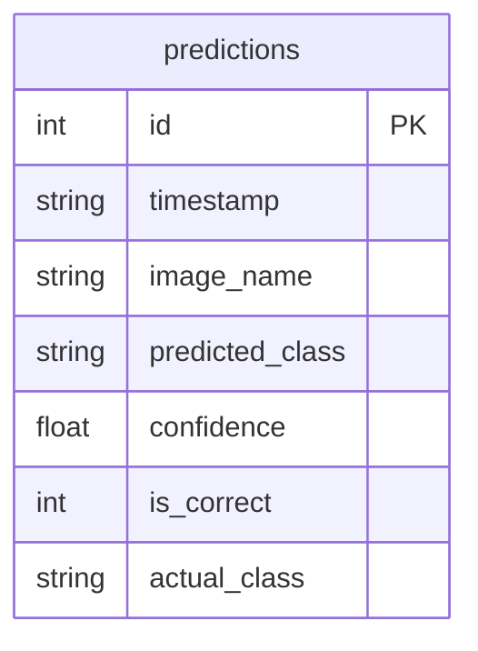

# Database Schema Documentation

This document describes the database schema used in the Waste Classification System.

## ER Diagram

## Table: `predictions`

| Column | Type | Description |
| :--- | :--- | :--- |
| `id` | INTEGER | Primary Key, Auto-incrementing identifier for each prediction. |
| `timestamp` | TEXT | The date and time when the prediction was made. |
| `image_name` | TEXT | The filename or path of the image being classified. |
| `predicted_class` | TEXT | The class name predicted by the model (e.g., Plastic, Metal). |
| `confidence` | REAL | The confidence score of the prediction (0.0 to 1.0). |
| `is_correct` | INTEGER | User feedback: 1 if the prediction was correct, 0 otherwise. |
| `actual_class` | TEXT | User-provided correct class if the prediction was wrong. |

## Usage
The database is managed by [database.py](file:///C:/Users/sanka/OneDrive/Desktop/Intern/database.py). It uses SQLite for lightweight, local storage of prediction history and performance metrics.
